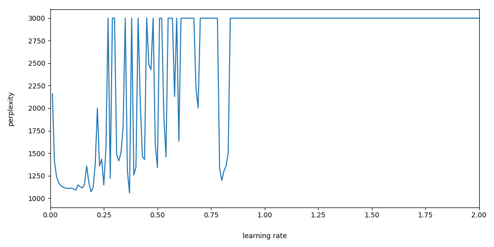

# debug_pytorch_lm

Started as a learning project to replicate [Recurrent Neural Network Regularization (Zaremba et al. 2014)](https://arxiv.org/pdf/1409.2329.pdf) in pytorch. However, it wasn't very long until I discovered the official [word language model example](https://github.com/pytorch/examples/tree/master/word_language_model); this changed the purpose of this repository to find out why

1. the implementation there results in very high perplexity scores (180 vs. 113-118 in TensorFlow)
1. even after fixing the two errors in the code, the numbers are worse than in TF.

## Errors in the official example

There are two discrepancies between the implementation in Zaremba (2014) and the official example:

1. The learning rate schedule is different: in the code, it is driven by the validation error, while in the paper, there is a fixed LR decay.
1. The loss in the example is averaged along both the batch and time dimensions. However, the proper BPTT loss is summed along the latter.
1. The sentences in the data are not shuffled.

The (pytorch) code in this repository is basically the copy of the official example, with the first two items above changed to reflect the implementation in the paper. The last difference is left as-is, because it is easy to account for (it results in better perplexities scores by approximately 5-10 point). There are a few other changes:

1. LSTM has been implemented from scratch (note that its input is batch size x time steps as in TensorFlow);
1. Only the small model is implemented.

With this, the loss at `LR == 1.0` actually **blows up**. Choosing the optimal learning rate (0.37) is only possible via a full parameter sweep (see below), but with it the model [_does_ arrive at the right numbers](logs/pytorch.log). However, any kind of optimization (that relies on local smoothness of the learning rate) is out of the question.

## Comparison with TensorFlow

The repository includes an implementation of the small model in TensorFlow. Similarly to the pytorch version, LSTM has been implemented from scratch, with the same formula as in pytorch. The TF script [reproduce the numbers in the paper](logs/tf.log) **with a wide range of learning rates**] (or rather it would, if the sentences were shuffled).

The package also includes tests to prove that the two implementations (TF vs PT) are equivalent. Also, the two Zaremba scripts allow the saving / loading of parameters, so it is possible to test the two implementations with exactly the same initial weights.

## Numerical instability

Even if the tests didn't find any differences (as far as [`numpy.allclose`](https://docs.scipy.org/doc/numpy-1.14.0/reference/generated/numpy.allclose.html) could tell), training losses diverge between the two versions. I performed a few experiments to see why.

### Tracing
Both scripts accept the `--trace-data`/`-T` parameter, which prints the weights, gradients, loss, etc. to `stdout`. The `logs` directory contains traces for both TF and PT (with `LR == 1.0`), up to 10 iterations. The trace is a bit wordy, but searching for `LOSS` shows this picture:

| Iteration | TF loss | PT loss |
|-----------|---------|---------|
|  1 | 184.22 | 184.22 |
|  2 | 177.71 | 177.71 |
|  3 | 155.49 | 155.49 |
|  4 | 164.65 | 177.38 |
|  5 | 178.24 | 175.73 |
|  6 | 166.46 | 187.57 |
|  7 | 160.93 | 193.06 |
|  8 | 161.98 | 202.22 |
|  9 | 157.46 | 365.33 |
| 10 | 158.67 | 273.83 |
| 11 | 166.02 | **1887.22** |

As the table shows, while the loss is the same for the first few iterations, already at the eleventh the difference is huge: for TF, the loss stays in the 100--200 range, while for PT, it is in the thousands.

### Hyperparameter search
Since the perplexity even after 1/10 of the data is a very strong indicator for the final score, I did a quick hyperparameter search to find the optimal LR. Who knows, maybe it is simply different for TF and PT? I ran the training up to 200 iterations, and tried values from 0.01 to 2.0 in 0.01 increments. The results are in the `log` directory:

| File | Library | Float size | Device |
|------|---------|------------|--------|
| `tf_loss_at_lr.txt` | TensorFlow | 32 bit | GPU |
| `pt_loss_at_lr.txt` | Pytorch    | 32 bit | GPU |
| `pt_loss_at_lr_64.txt` | Pytorch    | 64 bit | GPU |
| `pt_loss_at_lr_cpu.txt` | Pytorch    | 32 bit | CPU |

The following graphs show the perplexity against the LR.

| TensorFlow, PPL vs LR |
|-----------------------|
|  |

| Pytorch, PPL vs LR, 32 bit (cut at 3000) |
|-----------------------|
|  |

| Pytorch, PPL vs LR, 64 bit (cut at 3000) |
|-----------------------|
|  |

| Pytorch, PPL vs LR, 32 bit, CPU (cut at 3000) |
|-----------------------|
|  |

As can be seen, while the TF graph is nice and smooth(ish), with no extreme values and only two spikes, the PT graphs (GPU / CPU, 32 / 64 bit) are all over the place. (Perplexity is cut at 3000 -- the maximum value is in the order of `e+280`.) It seems as if PT is not just more sensitive to the learning rate, but its effect on the result is completely chaotic. It seems that the underlying implementation in Pytorch is **numerically unstable**.

(Note that this instability persists if I replace my `SequenceLoss` with the original loss function multiplied by `num_steps`, so the problem is not because of that.)

### How to reproduce

Use the two scripts in the `scripts` directory. First, generate a set of weights with either version, e.g.
```
python scripts/zaremba_pytorch.py -c -d ptb/ -S params
```
, where the data directory contains the train, valid and test splits of the PTB, preprocessed by Mikolov. It can be acquired from e.g. [here](http://www.fit.vutbr.cz/~imikolov/rnnlm/simple-examples.tgz).

Then, both scripts can be run with the saved weights:
```
python scripts/zaremba_pytorch.py -c -d ptb/ -L params.npz
python scripts/zaremba_tf.py -d ptb/ -L params.npz
```

Both scripts accept the `-T <iterations>` parameter, which runs for `<iterations>`, printing the basically everything (inputs, intermediate values, gradients, loss, etc.) at each step, then exits.

Versions of the libraries used:

| Library | Version | Comments |
|---------|---------|----------|
| Pytorch | 0.4.0a0+c65bd66 | Also the latest 0.4.0a0+5eefe87 |
| Tensorflow | 1.4.1 | In a different environment, because in conda, it brings in a different CuDNN version |
| CuDNN   | 6021 | According to `torch.backends.cudnn.version()` |
| CUDA    | 8.0  | |
| mkl     | 2018.0.1 | from `conda list` |
| numpy   | 1.14.0 | from `conda list` |
